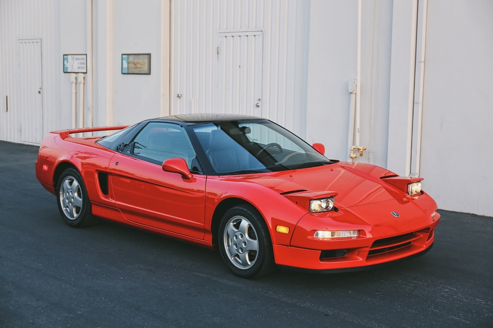

## The Iconic Honda NSX

The Honda NSX, in any other case known as the Acura NSX in North America, is one of the most iconic sports cars of the 1990s, introducing new technology with brilliant performance. It had been a milestone for Honda-proof that the company could indeed build a world-class sports car. But the Honda NSX generation that first appeared in 1990 indeed has a peculiar place in automotive lore, and the story of this car is one of passion, innovation, and excellence.

## Origins of the NSX

_Image from: Sackey, S., & Sackey, S. (2016, September 28). The original Acura NSX: Development history and driving the icon. Autoblog. https\://www\.autoblog.com/2016/09/28/the-original-acura-nsx-development-history-and-driving-the-icon/_

It was the middle of the 1980s, a time when Honda had just gotten a strong foothold in reliable and efficient cars. But Honda was eager to transcend its bread-and-butter image to prove it could hold its own against the globe's best, most specifically Ferrari. The idea behind the NSX-which stood for New Sportscar eXperimental-was to provide a car that, for all intents and purposes, had supercar capabilities but retained the high degree of reliability and ease of use, not to say relatively reasonable price, for which Honda was known. Honda wanted a supercar that could go on a racetrack and go back in one piece. You should park it in the street. See out of it. Survive in an accident. The Honda NSX should be a good and reliable car. It was a revolutionary concept. Unlike what Italy was making in the 1980’s.

## “Transpiration”: How Honda Revolutionized the use of Aluminum in Automotive Industries

From the start, the NSX was an ambitious undertaking. With that, Honda set out to create a car that was fast and agile but also practical enough to handle daily driving duties. Chief Designer Masahito Nakano and Executive Chief Engineer Shigeru Uehara helmed the design team, whose goal was to innovate advanced technology with everyday usability in driving this car. The development process also drew much from Formula 1 driver Ayrton Senna, who helped tune and sort out the chassis and handling dynamics of the car.

Of all, the most impressive feature of the NSX was its all-aluminum monocoque body, a first for any production car. The engineers of Honda was inspired by Japan’s Bullet Train with its aluminum and so this concept was introduced. This design breakthrough greatly shed much-needed pounds off the car's weight, improving performance and handling. The NSX also featured a mid-engine layout that further contributed to its ideal weight distribution and exceptional driving dynamics.

Under the hood, the NSX came with a 3.0-liter V6, code-named C30A, fitted with Honda's VTEC-Variable Valve Timing and Lift Electronic Control. For its time, the respectable 270 horsepower were especially welcome considering the lightness of the car. The engine came mated either to a 5-speed manual transmission or to a 4-speed automatic; the former being the preferred choice for enthusiasts.

## Unveiling The Ultimate Halo car of Honda:

The Honda NSX made its public debut at the 1989 Chicago Auto Show, and from the start, it was patently obvious: Honda had created something special. Almost immediately following its official launch in 1990, praise about the NSX spread like wildfire. It was commended for its combination of performance, refinement, and reliability: a combination virtually never heard of in the supercar segment. The NSX gave an exciting but accessible driving experience available to a much wider range of drivers than most of its rivals.

The handling especially was singled out for praise with many reviewers noting its exceptional balance and precision. Much of this was due to the lightness of the car and the extensive testing and feedback that Ayrton Senna provided. The NSX had a relatively spacious and comfortable interior for a sports car, which furthered its appeal as a car that could be driven daily.

The NSX was never built in massive quantities in raw numbers, however, but still managed to find a certain level of success that would enshrine it firmly within the annals of automotive history. It's price was high as it was for a Honda nonetheless relatively approachable when compared against European exotic contemporaries, and represented a net advantage to enthusiasts desiring a high-performance car not usually associated with sour dependability expectations.

## An end of an Automotive Icon:

In all, several updates were availed to the NSX during its production run that lasted until the year 2005. In 1997, Honda gave it a larger 3.2-liter V6 motor that upped power to 290 horsepower. Coupled with the motor change, a 6-speed manual transmission was also fitted to the NSX to further improve its performance credentials. Other refinements over time included cosmetic updates, chassis improvements, and a limited edition NSX Type R model, more concerned with weight reduction and track performance.

Because of that fact, the NSX remained competitive throughout its production life and stood testament to how right its original design was. By the time production ended in 2005, the NSX had achieved legendary status in the automotive world, admired not only for its performance but also for having played a significant role in redefining what a supercar could be.

## Conclusion: The Timeless Legacy of the First-Generation Honda NSX

The first-gen Honda NSX is, in fact, an icon--a car that perfectly exclaims how well the pinnacle of Honda's engineering could do and stand shoulder to shoulder with the best of the best in this world. It set new benchmarks for this segment in terms of performance, reliability, and real-world usability; the effect of which can even be seen in modern sports cars. The NSX's legacy as an icon of innovation and excellence continues to make it extremely popular with both collectors and enthusiasts in general.

_REFERENCES_:

_Tromans, P. (2024, May 28). An Idiot’s Guide to the Honda NSX: History and generations. CarThrottle. https\://www\.carthrottle.com/news/honda-nsx-everything-you-need-know-about-legendary-sports-car_

_History of the Honda NSX. (n.d.). https\://www\.nsxclub.co.uk/Cms/Spaces/PUBLIC/History+of+the+Honda+NSX_

_Honda Global | The NSX / 1990. (n.d.). https\://global.honda/en/heritage/episodes/1990thensx.html_

_THE SQUIDD. (2022, March 29). NSX: How Honda broke Supercars \[Video]. YouTube. https\://www\.youtube.com/watch?v=8hno6t2AYi0_
